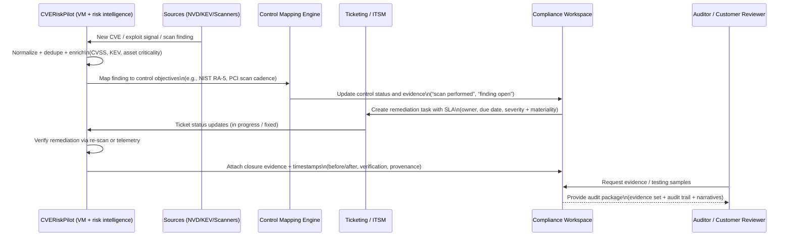

# Bridging Compliance and Security Tooling: Market Gap and Transition Plan for CVERiskPilot

## Executive summary

The “gap” between compliance and security tooling is not primarily a technology gap; it is a **translation and assurance gap**: security tools generate high-volume technical signals (vulnerabilities, misconfigurations, alerts), while compliance programs must produce **defensible proof** (mapped controls, evidence, audit trails, attestations) that holds up under regulator, auditor, and customer scrutiny. This gap persists because security tools are optimized for **risk reduction throughput** (prioritize → remediate), while compliance tools are optimized for **audit readiness throughput** (map → evidence → attest). The missing layer is a **Compliance Intelligence Platform (CIP)** that reliably converts security/IT telemetry into **control outcomes, evidence artifacts, and audit-ready narratives** without breaking traceability.

Economically, the opportunity is supported by multiple adjacent, growing markets rather than a single neatly defined category: enterprise GRC, compliance software, security & vulnerability management, and cloud posture/compliance tooling are all multi‑billion dollar markets with sustained growth. citeturn0search4turn0search23turn0search1turn0search2 The “between” market is best understood as the **intersection budget** where organizations are buying (a) continuous control monitoring and (b) automation of evidence + remediation workflows, as exemplified by platform directions in enterprise IRM/GRC and modern compliance automation. citeturn11search18turn11search17turn3search23turn3search1turn3search14

Regulators and standards bodies increasingly expect **risk-based controls, ongoing testing, and monitorable evidence**, aligning compliance outcomes to security operations. Examples include GDPR’s requirement for “appropriate” technical/organizational measures and regular evaluation of effectiveness, PCI DSS’s explicit cadence for external vulnerability scanning, NIST’s control families for vulnerability monitoring/scanning, and ISO 27001’s ISMS requirements. citeturn15view0turn16view0turn14view3turn9search0turn2search19

Strategically, the fastest path to transition **CVERiskPilot** into a Compliance Intelligence Platform is to use its existing strength—**CVE-centric risk intelligence**—as the anchor for a “security-to-controls” graph:
- Map CVE posture into control requirements that explicitly demand vulnerability management/testing (e.g., PCI scanning, NIST RA‑5, ISO vulnerability management controls). citeturn16view0turn14view3turn2search19  
- Add the missing assurance primitives: **controls library + crosswalks**, **evidence objects** with provenance, **immutable audit trails**, and **audit-ready reporting** that can be exported or served via APIs. citeturn11search2turn3search14turn3search7turn11search0  
- Expand remediation workflows beyond security tickets into **policy exceptions, compensating controls, approvals, and recertifications**—the mechanics auditors and compliance leaders require. citeturn3search7turn9search7turn1search6  

## Market landscape and sizing

### Adjacent markets that fund the “between” space

Because “Compliance Intelligence Platform” is an emerging convergence concept (not yet a clean analyst category), sizing should be framed as: **adjacent category spend** + **converging workflows** + **share-of-wallet capture** from compliance and security budgets.

The following chart visualizes baseline market sizes commonly used as proxies for budget availability in the compliance↔security convergence layer.


Data points (baseline year and growth) come from the following market research sources:
- Enterprise GRC (eGRC): 2025 size estimated at **$72.42B**, projected to **$203.65B by 2033** (CAGR **13.7%** from 2026–2033). citeturn0search4  
- Compliance software: 2025 size **$35.37B**, projected to **$74.12B by 2031** (CAGR **12.67%** over 2026–2031). citeturn0search23  
- Security & vulnerability management: 2025 size **$17.9B**, projected to **$32.71B by 2034** (CAGR **6.93%** over 2026–2034). citeturn0search1  
- Cloud security posture management (CSPM): 2025 size **$6.34B**, projected to **$10.37B by 2030** (CAGR **10.3%** over 2025–2030). citeturn0search2  

**Important sizing caveat:** these categories overlap conceptually and commercially (e.g., “compliance software” vs. “eGRC” definitions). Treat them as **directional spend pools**, not additive totals. citeturn0search4turn0search23

### Growth drivers specific to the compliance↔security gap

The expansion of the “between” market is driven by changes in how organizations are expected to manage cyber risk and demonstrate accountability:

- **Governance becomes part of cybersecurity outcomes.** entity["organization","National Institute of Standards and Technology","us standards agency"]’s Cybersecurity Framework 2.0 introduced/foregrounded a “Govern” function that explicitly ties cybersecurity risk strategy, policy, oversight, and supply chain risk management to broader enterprise risk management. citeturn13view3turn6search4  
- **From point-in-time audits to continuous monitoring.** Vendors increasingly position platforms around continuous monitoring of control performance and evidence readiness (e.g., continuous control monitoring, real-time compliance scoring, evidence automation). citeturn11search18turn11search1turn11search17  
- **Cloud scale and drift.** CSPM/CNAPP tools frame compliance as a posture problem (drift + misconfiguration), which creates ongoing demand for continuous evidence of configuration correctness and remediation. citeturn0search2turn5search19  
- **AI governance and “oversight gaps.”** entity["company","IBM","technology company"]’s Cost of a Data Breach research emphasizes governance and security gaps around AI adoption as a modern risk driver for security and governance programs. citeturn6search1  
- **Machine-readable compliance and assessment automation.** entity["organization","Forum of Incident Response and Security Teams","cvss maintainer"]’s CVSS specification formalizes vulnerability severity metrics, while entity["company","Forrester","research and advisory firm"] and others emphasize a shift toward more real-time, decision-ready risk insight in GRC markets—which pushes vendors toward automation and interoperability standards such as OSCAL. citeturn10search0turn6search3turn11search0  

## Buyers, use cases, and regulatory drivers

### Buyer personas and what each “buys”

The compliance↔security gap exists partly because the buying center is fragmented: different personas value different “definition of done,” even for the same underlying control.

| Persona | “Job to be done” | What they evaluate first | What makes them churn | Winning message for a Compliance Intelligence Platform |
|---|---|---|---|---|
| Security leadership (CISO/VP Security) | Reduce exposure time and prove risk reduction | Risk prioritization, remediation throughput, integration with IT workflows | Noisy scoring; poor ownership mapping; low fix rates | “Translate security work into board- and auditor-ready proof; fewer ‘critical’ distractions; faster closure.” citeturn5search0turn5search15turn13view3 |
| Vulnerability management / SecOps | Operationalize scanning → prioritization → tickets | Scanner integrations, prioritization logic, ticketing loops | Data quality issues; duplicate/unclear ownership | “Closed-loop remediation and evidence trails for every scan and fix.” citeturn5search2turn10search2 |
| GRC / Compliance leadership | Maintain control framework, evidence, and audit readiness | Control mapping, evidence automation, audit trail quality | Manual evidence burden; inconsistent mappings | “Test once, reuse across frameworks; continuous evidence with provenance.” citeturn11search2turn11search34turn3search7 |
| Enterprise risk management | Aggregate risks across domains into ERM language | Standardized scoring, aggregation, reporting | Tools that can’t normalize technical inputs | “Normalize technical risk into ERM-aligned, explainable control outcomes.” citeturn13view3turn3search23 |
| Legal / privacy leadership | Demonstrate accountability, reduce liability, ensure privacy governance | Audit trails, policy alignment, privacy governance workflows | Weak traceability; unclear approvals and exceptions | “Defensible audit trails and policy decision logs; evidence-backed claims.” citeturn15view0turn7search11 |
| Executives / Board / Audit committee | Oversight and defensible reporting | KPIs, risk posture trends, assurance narrative | Dashboards that don’t connect to evidence | “Decision-ready risk posture backed by drill-down evidence and repeatable reporting.” citeturn6search3turn8search3 |

### Regulatory and standards drivers that explicitly link security actions to compliance proof

A Compliance Intelligence Platform is easiest to justify when frameworks **explicitly require** activities that security tools already perform—but compliance programs need to evidence and attest.

- **GDPR (security of processing).** The entity["organization","European Union","supranational organization"]’s GDPR requires controllers/processors to implement appropriate technical and organizational measures considering risk, including confidentiality/integrity/availability/resilience, restoration capability, and a process for regularly testing and evaluating the effectiveness of measures (Article 32). citeturn15view0turn15view1  
  *Implication:* compliance isn’t only “policy existence”; it is **ongoing measurable control effectiveness**, which is instrumentation-friendly.

- **SOX (internal control over financial reporting).** entity["organization","U.S. Securities and Exchange Commission","federal securities regulator"] materials on Section 404 emphasize management reporting on internal control over financial reporting (ICFR) and related auditor attestation requirements. citeturn9search7turn9search11  
  *Implication:* evidence and audit trails must support **defensible control design and operating effectiveness**.

- **HIPAA Security Rule.** entity["organization","U.S. Department of Health and Human Services","us health regulator"] describes the need for administrative, physical, and technical safeguards to protect ePHI. citeturn1search2 The Security Rule’s administrative safeguards include requirements like regular review of records of information system activity (audit logs, access reports, incident tracking). citeturn1search6  
  *Implication:* audit logging and review processes can be operationalized as **evidence objects** and recurring tests.

- **PCI DSS v4.0.1 (vulnerability scanning cadence).** PCI DSS explicitly requires external vulnerability scans “at least once every three months” by an Approved Scanning Vendor, along with rescans to confirm remediation (Requirement 11.3.2 in v4.0.1). citeturn16view0  
  *Implication:* vulnerability scanning and remediation workflows are **direct compliance obligations**, not optional security best practices.

- **NIST SP 800-53 control RA‑5 (vulnerability monitoring and scanning).** NIST SP 800‑53 includes RA‑5 as “Vulnerability Monitoring and Scanning,” reinforcing vulnerability management as a control family with enhancements, and aligning it with broader risk assessment and control assurance. citeturn14view3turn12view1  
  *Implication:* vulnerability telemetry can be mapped to **control evidence** in a structured way.

- **ISO/IEC 27001 (ISMS).** entity["organization","International Organization for Standardization","standards body"] describes ISO/IEC 27001 as the best-known ISMS standard defining requirements for establishing, implementing, maintaining, and continually improving an ISMS. citeturn9search0turn9search24 ISO 27001:2022 includes vulnerability management controls (e.g., Annex A 8.8 “Management of Technical Vulnerabilities” summarized in implementation guidance). citeturn2search19turn2search23  
  *Implication:* vulnerability management can be presented as an ISMS control with owners, procedures, and evidence.

## Tool categories, vendor landscape, and capability gap

### Tool categories that sit on each side of the gap

The most relevant categories (and why they fail to fully replace each other) are:

- **Security-first:** vulnerability management (VM), CNAPP/CSPM posture management, security automation. These excel at detection/prioritization/remediation but generally under-provide audit-grade orchestration across frameworks. citeturn5search0turn5search1turn5search19  
- **Compliance-first:** compliance automation and trust platforms. These excel at evidence assembly and framework mapping but often rely on upstream security tools for high-fidelity technical findings. citeturn3search1turn3search14turn17search0  
- **GRC/IRM platforms:** enterprise workflows, policy management, risk registers, audits. These provide governance and cross-functional mapping but historically require heavy configuration and integration work to achieve continuous technical evidence collection. citeturn3search23turn8search13turn3search7  
- **Privacy and compliance governance:** privacy automation and AI governance tooling; typically anchored in legal/privacy functions with different data models and evidence expectations. citeturn7search4turn7search11  

### Representative vendors and where each one “lands” on the convergence spectrum

| Vendor | Core category | Typical primary buyer | Strengths relevant to compliance↔security convergence | Common gap relative to a “full” Compliance Intelligence Platform | Primary-source anchors |
|---|---|---|---|---|---|
| **entity["company","ServiceNow","enterprise workflow platform"]** | Enterprise IRM / GRC | Enterprise risk & compliance, audit | Cross-mapping policies/controls to external regs; structured workflows for assessment and continuous monitoring; explicit evidence request workflows. citeturn8search13turn3search7 | Often needs significant implementation and integrations to achieve deep technical evidence automation at scale. citeturn8search25turn3search23 | citeturn8search13turn3search7turn11search1 |
| **entity["company","Archer","integrated risk management company"]** | Enterprise IRM / GRC | Risk, audit, compliance | Configurable integrated risk management platform for multiple dimensions of risk. citeturn4search1 | Technical signal ingestion and continuous evidence depth varies by connector maturity/implementation. citeturn4search1turn10search25 | citeturn4search1turn10search25 |
| **entity["company","MetricStream","grc software company"]** | Enterprise GRC | Enterprise GRC, regulators-facing teams | Broad compliance, policy/document management, regulatory change; audit planning/execution and evidence collection workflows. citeturn7search2turn7search16 | Can skew toward enterprise process management; “security signal → evidence” may still require custom work. citeturn7search2 | citeturn7search2turn7search16 |
| **entity["company","Workiva","cloud reporting and grc company"]** | SOX / controls / GRC platform | SOX owners, internal audit, finance | Unified SOX workflows with risk assessments, control testing, evidence management; emphasizes audit trails and real-time oversight. citeturn8search1turn8search3 | Less natively anchored in CVE/vulnerability signals; security evidence typically comes via integrations or adjacent tools. citeturn8search1turn17search3 | citeturn8search1turn8search3turn17search3 |
| **entity["company","Diligent","governance and grc company"]** | Audit + continuous monitoring | Internal audit, risk | Positions continuous controls monitoring and real-time monitoring/reporting; emphasizes connector breadth and transaction-scale analytics. citeturn8search4turn8search6 | Often oriented toward analytics on business/ERP data; CVE-to-control mapping is not typically the “front door.” citeturn8search4 | citeturn8search4turn8search6 |
| **entity["company","Hyperproof","grc software company"]** | Modern GRC + continuous monitoring | Compliance ops, security compliance | Strong “common controls” positioning: centralize controls, link to requirements, automate evidence, reuse across frameworks; positioned for continuous controls monitoring. citeturn11search2turn11search18turn11search34 | Typically requires upstream security tools for high-fidelity vulnerability detection unless integrated. citeturn11search18turn7search0 | citeturn11search2turn11search34turn7search0 |
| **entity["company","Vanta","compliance automation company"]** | Compliance automation + trust | Security & compliance (mid-market/SaaS) | Evidence collection and “tests”; API to build custom evidence/testing integrations; integrated trust center narrative. citeturn3search1turn3search5turn17search0 | Risk scoring tends to be control-test-centric; deep technical risk prioritization (exploitability, attack paths) usually lives elsewhere. citeturn3search5turn5search15 | citeturn3search1turn3search5turn17search0 |
| **entity["company","Drata","compliance automation company"]** | Compliance automation + “compliance as code” | Security & compliance | Open API emphasizes audit trail for changes; evidence library; compliance-as-code positioning for IaC drift/guardrails; trust center. citeturn3search14turn3search25turn11search7turn17search1 | Technical risk depth often depends on the connected security sources; must avoid becoming a “control UI” disconnected from operational remediation. citeturn11search7turn3search14 | citeturn3search14turn11search7turn3search25 |
| **entity["company","Secureframe","compliance automation company"]** | Compliance automation + trust | Compliance + revenue teams | Continuous monitoring/evidence automation messaging; trust center with real-time pulled data; multi-framework positioning. citeturn17search6turn17search26turn17search10 | Like peers, depends on upstream technical telemetry; “CVE intelligence” is not core unless integrated. citeturn17search26 | citeturn17search6turn17search10turn17search26 |
| **entity["company","OneTrust","privacy and risk management company"]** | Privacy, risk & compliance automation | Privacy/legal, risk | Compliance automation includes evidence collectors and control/evidence tasks across many standards; broad integration ecosystem with APIs/SDKs/data feeds. citeturn7search11turn7search7 | Tends to be strongest where governance content is privacy/data-centric; “CVE-to-controls” security workflows require deliberate alignment. citeturn7search11 | citeturn7search11turn7search7 |
| **entity["company","Wiz","cloud security company"]** | CNAPP / cloud posture | Cloud security teams, platform engineering | Positions compliance frameworks coverage and mapping technical controls for reporting; security graph narrative to unify context across cloud risks. citeturn5search3turn5search15turn5search19 | Cloud-first: people/process controls and non-cloud evidence can be out of scope; audit workflows are not the core “system of record.” citeturn5search19 | citeturn5search3turn5search15turn5search19 |
| **entity["company","Qualys","cybersecurity company"]** | VM + compliance reporting | Security & VM programs | VMDR explicitly promotes vulnerability + compliance reporting and prioritization; includes PCI ASV assessments and CIS benchmark evaluations as part of security/compliance reporting. citeturn5search1turn5search9 | Evidence packaging for audits across multiple frameworks (and audit trail governance) is typically not delivered as a compliance system-of-record. citeturn5search1 | citeturn5search1turn5search9 |
| **entity["company","Tenable","cyber exposure management company"]** | VM + prioritization | Security & VM programs | VPR integrates threat + impact concepts to prioritize remediation; designed to improve remediation efficiency and dynamically updates over time. citeturn5search0turn5search4 | Mapping to multiple compliance frameworks and producing audit-grade evidence trails usually requires downstream GRC tooling. citeturn5search0turn14view3 | citeturn5search0turn5search4 |
| **entity["company","Rapid7","cybersecurity company"]** | VM + remediation workflows | Security & VM programs | Integrations describe closed-loop workflows into ITSM/SecOps platforms, including automatic ticket creation and closure when fixed. citeturn5search2turn5search22 | Still not a cross-framework compliance evidence system-of-record by default; requires compliance-layer tooling for attestations and audit requests. citeturn5search2turn3search7 | citeturn5search2turn5search22 |

### Where overlap exists—and why the gap still matters

A simplified way to see the “between” market is to categorize platform capabilities into four buckets: security-first, compliance-first, shared overlap, and the bridging “intelligence” layer. The chart below is a structured synthesis (not an analyst taxonomy) to highlight where product investment must focus to win “between” budgets.


This distribution is an **author synthesis** informed by vendor product documentation and standards expectations; it is intended to guide prioritization (what to build) rather than to claim a market consensus ranking. citeturn11search17turn3search14turn5search15turn11search2

### Feature overlap and gaps

| Capability area | Security-first tools (VM/CNAPP) | Compliance automation | Enterprise GRC/IRM | **Compliance Intelligence Platform target** |
|---|---|---|---|---|
| Data sources | Strong in scanners, cloud configs, runtime context. citeturn5search1turn5search15 | Strong in SaaS/stack integrations for evidence. citeturn3search13turn3search1 | Broad enterprise systems via integrations/CMDB, but often slower to implement. citeturn8search25turn3search23 | Unified ingestion: security telemetry + business systems + governance artifacts; stable connectors + APIs. citeturn11search0turn10search2 |
| Automation | Strong in scanning/workflows; some ticket automation. citeturn5search2turn5search22 | Strong in evidence automation and recurring tests. citeturn3search5turn3search14 | Strong in workflow orchestration, reviews, approvals. citeturn3search7turn8search13 | Policy→control→evidence automation + security remediation loops; fewer manual steps. citeturn11search18turn5search2 |
| Evidence collection & provenance | Usually indirect (exports, reports). citeturn5search1turn5search0 | First-class evidence objects and history. citeturn3search25turn3search5 | Evidence requests supported; systems-of-record orientation. citeturn3search7 | Evidence objects with explicit provenance (source, timestamp, query, auth context), versioning, retention policies. citeturn11search0turn1search6 |
| Audit trails | Strong logging in security stacks, but not audit narrative. citeturn5search2 | Explicit audit trails for platform actions and evidence ops. citeturn3search14turn3search5 | Strong reportable governance trails, approvals, attestations. citeturn8search13turn9search7 | Unified audit event ledger (control changes, evidence changes, exceptions, approvals) with exportable audit views. citeturn11search34turn3search14 |
| Reporting | Strong risk dashboards, posture reporting. citeturn5search15turn5search9 | Compliance readiness and auditor views. citeturn3search5turn17search9 | Board, ERM, compliance score/reporting. citeturn11search1turn8search3 | Multi-audience reporting: Security (fix), Compliance (evidence), Exec/Board (measures & trends), Legal (defensibility). citeturn13view3turn11search34 |
| Risk scoring | Uses CVSS + vendor scoring models; exploitability context in some. citeturn5search0turn5search9turn10search10 | Often pass/fail test posture; some risk modules. citeturn3search5turn4search7 | Risk registers and quantitative/qualitative scoring models. citeturn3search23turn4search1 | Dual scoring: technical risk (attack likelihood/impact) + compliance risk (control failure materiality) + mapped narratives. citeturn13view3turn16view0 |
| Remediation workflows | Ticketing and closure workflows are common. citeturn5search2turn5search22 | Remediation instructions for failing tests; but needs tight IT ownership mapping. citeturn3search5 | Strong issues/controls remediation workflows. citeturn3search23turn3search7 | Unified workflow: fix tasks + exceptions + compensating controls + due dates + attestations + re-test. citeturn9search11turn1search6 |
| Integrations & APIs | Growing APIs; GraphQL in some. citeturn5search39turn5search16 | APIs explicitly designed to ingest evidence from unsupported systems. citeturn3search1turn3search14 | Integration frameworks exist but can be heavier. citeturn8search25 | Integration platform strategy: API-first ingestion + “connector marketplace” + outbound webhooks + data export. citeturn11search0turn3search21 |
| Scalability | Data-volume scalable, but evidence semantics absent. citeturn5search15turn5search1 | Scales in mid-market; enterprise scaling varies. citeturn4search7turn7search6 | Enterprise scale, but high implementation cost. citeturn3search23turn8search25 | “Control graph” + “evidence lake” architecture with tenancy, RBAC, and traceability at scale. citeturn11search0turn11search2 |
| ML/AI | Prioritization and summarization in some. citeturn5search8turn5search9 | Questionnaire automation, summaries, policy assistance. citeturn17search10turn11search38 | AI for analytics and monitoring is increasingly emphasized. citeturn8search7turn6search26 | AI as “copilot,” with strict auditability: explainable outputs, provenance, and human approvals. citeturn6search1turn11search34 |

## Reference architectures and technical design patterns

### What “Compliance Intelligence” means architecturally

A Compliance Intelligence Platform is an **assurance system** built on a **control/evidence graph** plus an ingestion layer that turns raw telemetry into auditable evidence. Emerging standards like OSCAL exist to make controls, implementations, and assessments machine-readable in XML/JSON/YAML, supporting automated control-based assessments. citeturn11search0turn3search0turn3search8

For CVERiskPilot, the strategic leverage is: **you already have a high-value telemetry stream (CVE risk)** and can become the control evidence engine for vulnerability-related controls across frameworks (NIST RA‑5, PCI vulnerability scan requirements, ISO vulnerability management). citeturn14view3turn16view0turn2search19

### Reference architecture for a Compliance Intelligence Platform

```mermaid
flowchart LR
  subgraph Sources[Telemetry & Governance Sources]
    A1[Vulnerability scanners & EDR signals]
    A2[NVD CVE data + updates]
    A3[CISA KEV catalog]
    A4[Cloud posture configs]
    A5[Identity & access logs]
    A6[Ticketing / ITSM status]
    A7[Policies, procedures, attestations]
    A8[Audit requests & auditor notes]
  end

  subgraph Ingest[Ingest & Normalization Layer]
    B1[Connector SDK + API gateway]
    B2[Event bus / queue]
    B3[Normalization + deduplication]
    B4[Provenance capture\n(source, query, auth, timestamp)]
  end

  subgraph Core[Control & Evidence Graph]
    C1[Assets / services / entities]
    C2[Findings\n(CVEs, misconfigs)]
    C3[Controls + control objectives]
    C4[Framework mappings\n(PCI, NIST, ISO, etc.)]
    C5[Evidence objects\n(auto + manual)]
    C6[Exceptions\n(risk acceptance, compensating controls)]
    C7[Remediation workflows\n(tasks, owners, SLAs)]
    C8[Audit trail ledger\n(immutable events)]
  end

  subgraph Intelligence[Compliance Intelligence Layer]
    D1[Risk scoring\n(technical + compliance materiality)]
    D2[Control effectiveness evaluation]
    D3[Continuous monitoring rules]
    D4[Reporting & export engine\n(PDF/CSV/API/OSCAL-like)]
    D5[AI copilot\n(summaries, mappings, drafts)]
  end

  subgraph Experiences[User & External Experiences]
    E1[Security workspace\n(prioritize & fix)]
    E2[Compliance workspace\n(evidence & audits)]
    E3[Executive dashboards\n(trends & KPIs)]
    E4[Auditor portal / evidence room]
    E5[Trust Center / customer due diligence]
  end

  Sources --> B1 --> B2 --> B3 --> B4 --> Core --> Intelligence --> Experiences
  E4 --> A8
```

**Key design patterns (validated by market dynamics):**
- **Machine-readable control objects**: standards like OSCAL exist explicitly to modernize security/compliance automation. citeturn11search0turn3search0turn3search12  
- **Data-source volatility management**: vulnerability sources evolve; for example, NVD has shifted/transitioned APIs and data feed approaches, requiring robust ingestion and backfill strategies. citeturn10search2turn10search9turn10search28  
- **Separation of “severity” vs “risk.”** CVSS is designed to measure severity and should not be used alone for risk decisions—risk scoring must incorporate context and business impact. citeturn10search10turn5search0turn5search9  
- **Action logging as first-class evidence.** Vendor API designs increasingly emphasize tracked changes and audit trails for actions taken through the platform. citeturn3search14turn3search5  

### Workflow: from CVE risk to audit-ready proof



This workflow directly supports compliance obligations that require vulnerability scanning and evaluation of security measures (PCI scanning cadence, GDPR evaluation of effectiveness, NIST RA‑5). citeturn16view0turn15view1turn14view3

## Go-to-market, pricing, and case studies

### Go-to-market motions that work in the “between” space

The market shows two dominant motions:

1) **Compliance-led entry, expand into security (“audit pain first”).** Compliance automation vendors emphasize automated evidence collection, tests, and trust centers for faster reviews. citeturn3search5turn17search0turn17search9  
2) **Security-led entry, expand into compliance (“risk pain first”).** Security posture and VM platforms increasingly message compliance frameworks coverage and reporting, but often stop short of full audit workflows. citeturn5search3turn5search1  

For a CVERiskPilot transition, the highest-probability motion is **security-led wedge + compliance expansion**:
- Wedge: “We prioritize the vulnerabilities that matter (exploitability + impact); we prove remediation.” citeturn5search0turn5search9turn10search10  
- Expansion: “We generate audit-ready evidence packages for PCI/NIST/ISO vulnerability controls and create defensible audit trails.” citeturn16view0turn14view3turn11search34  

### Pricing models seen across the convergence market

Because the convergence spans multiple budgets, packaging/pricing must align with “what is counted” in each world:

- **Per framework / per employee / per module (compliance automation).** Example: Drata’s plans are framed around organization size (FTE) and number of frameworks/features. citeturn4search7turn17search1  
- **Per asset / per scanner / per coverage dimension (security VM/CNAPP).** VM platforms emphasize asset discovery and risk prioritization; pricing commonly ties to asset volume and module count. citeturn5search1turn5search0  
- **Enterprise platform/value-based pricing (IRM/GRC).** GRC platforms and enterprise suites tend to be quote-based and depend on scale, integrations, and solution bundles. citeturn17search3turn3search23  

**Recommendation for CVERiskPilot packaging:**  
Adopt **two-axis packaging** that matches who signs:
- **Security package**: priced by asset/coverage (endpoints, cloud accounts, apps) with core CVE posture + remediation workflows.  
- **Compliance Intelligence add-on**: priced by frameworks/modules (PCI/NIST/ISO packs) + evidence automation + auditor portal + trust center export.

This aligns with how trust portals and evidence automation are positioned as revenue accelerators (e.g., trust centers automate reviews, speed sales cycles). citeturn17search0turn17search17turn17search6

### Case studies and lessons learned

#### Evidence automation via APIs is now table stakes
- Vanta markets an API for automating evidence collection/testing and building private integrations when native integrations don’t fit. citeturn3search1turn3search17  
- Drata’s Open API messaging emphasizes automating evidence collection with a visible audit trail of changes/actions. citeturn3search14turn3search10  
**Lesson:** A CIP without an **ingestion API + developer story** will lose in heterogeneous stacks and regulated environments.

#### Closed-loop remediation is a differentiator when it is provable
Rapid7’s documented integration with ServiceNow describes an automated loop: ingest scan data, create remediation tickets, close tickets when fixed. citeturn5search2  
**Lesson:** The “between” platform wins when it can show **causality**: *finding → owner → fix → verification → evidence*, not just dashboards.

#### “Common controls” reduces compliance cost; trust depends on reuse + traceability
Hyperproof explicitly positions a common control set that can be reused across compliance programs. citeturn11search2turn11search34  
**Lesson:** Cross-framework reuse (controls crosswalks) is not a nice-to-have; it is the structural path to scaling compliance as companies accumulate frameworks.

#### Integration cost is a hidden cost center—and a common failure mode
A Drata integration case study notes that integration build time can average multiple months when partnership/legal/engineering coordination is heavy. citeturn3search35  
**Lesson:** Treat integrations as a product line: stable SDKs, schemas, QA harnesses, and versioning; otherwise integration friction becomes churn.

#### Missed opportunities that a Compliance Intelligence Platform can capture
- **Severity ≠ risk**: CVSS explicitly warns it measures severity and should not be used alone to assess risk. citeturn10search10 Many organizations still operate as if CVSS alone is sufficient, leaving a market for “risk + compliance materiality” scoring that is explainable. citeturn13view3turn16view0  
- **Machine-readable compliance is underused**: OSCAL’s purpose is to automate control documentation and assessment, yet most commercial platforms still rely heavily on manual narrative/evidence handling. citeturn11search0turn3search8  
- **Trust workflows are monetizable**: trust centers are positioned as tools to streamline reviews and accelerate purchases by letting prospects self-serve security/compliance info. citeturn17search0turn17search8  
A CIP that connects “live control posture” to external trust workflows captures revenue enablement budgets—beyond pure security spend. citeturn17search9turn17search6  

## Transition roadmap for CVERiskPilot to a Compliance Intelligence Platform

### Assumptions about CVERiskPilot’s starting point

Because your prompt did not specify current product scope, the roadmap assumes CVERiskPilot currently has:
- CVE ingestion/enrichment (e.g., NVD), asset association, and risk scoring/prioritization using CVSS and/or proprietary factors. citeturn10search2turn10search10  
- Remediation workflow hooks (at minimum export or issue creation), and reporting for vulnerability posture trends. citeturn5search2turn5search22  

If your current capabilities differ, treat this roadmap as the target-state decomposition and adjust sequencing.

### Product positioning: define “Compliance Intelligence Platform” for buyers

A clear, defensible definition that maps to buyer pain:

> **Compliance Intelligence Platform:** a system that continuously evaluates security-relevant controls, automatically collects and preserves evidence with provenance and audit trails, translates technical findings into control outcomes across frameworks, and orchestrates remediation and exceptions to maintain audit-ready posture.

This maps directly to the expectations embedded in GDPR (risk-based measures + evaluation), PCI scanning cadence, and NIST’s vulnerability control families. citeturn15view1turn16view0turn14view3

### Step-by-step transition roadmap

#### Step one: establish the control and evidence data model (the “graph”)

Build a first-class domain model that can unify security signals and compliance obligations:

- **Control** (atomic requirement), **Control Objective** (logical grouping), **Framework Requirement** (PCI/NIST/ISO mapping), **Evidence** (object + provenance), **Test** (automated evaluation), **Exception** (risk acceptance/compensating control), **Remediation** (task + verification), **Entity** (asset/service/application/business unit).  
This aligns with how major GRC systems structure cross-mapped controls and continuous monitoring workflows. citeturn11search17turn3search7turn11search1  

Deliverable: a versioned schema and migration plan (including tenancy and RBAC).

#### Step two: ship the first compliance “content pack” anchored in vulnerability obligations

Choose frameworks where vulnerability management is explicit and audit evidence is straightforward:

- **PCI DSS vulnerability scanning evidence pack** (v4.0.1 Req. 11.3.2 external scans cadence; plus remediation confirmation and rescan evidence). citeturn16view0turn13view1  
- **NIST 800-53 vulnerability monitoring/scanning pack** anchored on RA‑5 outcomes. citeturn14view3turn12view1  
- **ISO/IEC 27001 vulnerability management pack** (Annex A vulnerability management controls, as summarized in implementation guidance). citeturn2search19turn9search0  

Deliverable: control mappings, evidence requirements, default tests, and auditor-ready export templates.

#### Step three: build evidence automation with API-first extensibility

- Implement an **Evidence Ingestion API** and **Connector SDK** (push/pull) so customers can integrate unsupported systems, similar to the role Vanta and Drata APIs play for evidence automation. citeturn3search1turn3search14  
- Make “audit trail” non-negotiable: every evidence write/update must generate an immutable event record (actor, source, timestamp, change details). This is increasingly emphasized in compliance automation APIs and audit workflows. citeturn3search14turn3search7  

Deliverable: connectors for at least one ticketing system + vulnerability scanner + cloud posture source; plus generic REST ingestion.

#### Step four: unify remediation, exception handling, and verification loops

A CIP must reconcile compliance realities:
- Not all issues can be fixed immediately (risk acceptance).
- Some controls are met via compensating controls (auditor acceptance depends on evidence and approvals).
- Verification matters: rescans, before/after states, and timestamps.

Design remediation workflows to handle:
- Ticket creation and closure loops (proven pattern in security remediation integrations). citeturn5search2turn5search22  
- Exception requests, approvals, expiration, and re-attestation aligned with governance expectations. citeturn9search7turn13view3  

Deliverable: unified “finding lifecycle” state machine shared by security + compliance views.

#### Step five: UI/UX split by persona, unified by the same data

Provide differentiated experiences over the same model:
- Security view: “What do we fix first?” (risk prioritization, ownership, SLAs). citeturn5search0turn5search9  
- Compliance view: “What evidence do we have? What’s missing? What’s stale?” (control readiness, evidence history). citeturn3search5turn3search25  
- Exec view: “Are we improving? Where are material risks?” (trend and KPI views). citeturn6search3turn8search3  

Deliverable: role-based workspaces and reporting.

#### Step six: go-to-market transition from “CVE risk tool” to “control evidence system”

- Update sales motions to land in security but expand into compliance leadership with audit readiness outcomes (“avoid the scramble” is a persistent market message). citeturn11search18turn11search34  
- Add partnership motions: auditors, MSP/MSSP, and security partners; trust centers are often positioned as revenue drivers and can support co-selling. citeturn17search0turn17search25  

Deliverable: packaging, enablement, and partner program design.

### Roadmap table with milestones, owners, and timelines

Assuming a default 18‑month transformation (adjustable), the table below is structured for portfolio management rather than strict project planning.

| Milestone | Outcome | Primary owner | Supporting owners | Timeline (relative) | Exit criteria |
|---|---|---|---|---|---|
| Product definition & target ICP hypotheses | Clear CIP definition, target frameworks and wedge | Product/Strategy | Compliance SME, Sales | Month 0–1 | PRD + pricing hypotheses + ICP narrative |
| Control & Evidence Graph v1 | New data model with audit trails and RBAC | Engineering | Product, Security research | Month 1–3 | Controls/evidence schema live; event ledger implemented |
| “Vuln Controls Pack” v1 | PCI + NIST RA‑5 + ISO vulnerability pack | Compliance content | Product, Eng | Month 2–4 | Crosswalks + templates; evidence checklist per control |
| Evidence Ingestion API + SDK | Customers can push evidence/tests; connector framework | Platform engineering | Product, Partner eng | Month 3–6 | Public API docs; SDK; 2 production connectors |
| Remediation + Exceptions lifecycle | Closed-loop remediation + risk acceptance | Engineering | Product, CS | Month 4–7 | Ticket loop + verification + exception expiration |
| Persona workspaces (Security/Compliance/Exec) | UI/UX aligned to buyers | Product + Design | Engineering | Month 5–8 | Role-based navigation; stable KPIs dashboards |
| Audit package exports | Auditor-ready evidence bundles | Engineering | Compliance SME | Month 6–9 | Exports for PCI/NIST/ISO; evidence traceability report |
| Trust workflows (optional) | External “trust portal” or export-friendly artifacts | Product | Partnerships, Marketing | Month 8–12 | Customer-ready sharing workflow; access control; engagement metrics |
| Scale & governance hardening | Enterprise readiness (multi-tenant, audit log immutability, data retention) | Security engineering | Platform, Legal | Month 9–15 | Pen test; retention policies; performance SLOs |
| Expansion packs | Add HIPAA/GDPR/SOX mappings beyond vuln controls | Compliance content | Product, Sales | Month 12–18 | New packs GA; cross-framework reuse proven |

Regulatory drivers justify early focus on vulnerability controls (PCI scan cadence, NIST RA‑5, ISO vulnerability management) while later packs expand into broader governance and audit expectations (SOX, HIPAA, GDPR). citeturn16view0turn14view3turn2search19turn9search7turn1search2turn15view1

### Prioritized feature list with estimated effort and impact

Effort is a coarse estimate (S/M/L/XL) assuming a modern SaaS team; impact is assessed by (a) buyer willingness-to-pay, (b) differentiation, and (c) unlock of future roadmap.

| Priority | Feature | What it unlocks | Est. effort | Est. impact | Notes / evidence anchors |
|---|---|---|---|---|---|
| P0 | Control & Evidence Graph + audit event ledger | Foundation for everything else | L | Very High | Required for defensible audit trails and control-based reporting. citeturn11search0turn3search14 |
| P0 | PCI/NIST/ISO vulnerability controls content pack | Immediate “compliance proof from CVE work” story | M | Very High | PCI scan cadence is explicit and auditable. citeturn16view0turn14view3turn2search19 |
| P0 | Evidence ingestion API + connector SDK | Integrates long-tail systems; reduces services burden | L | Very High | Mirrors market expectation set by compliance automation APIs. citeturn3search1turn3search14 |
| P1 | Remediation + verification loops (ticketing integration) | Proves outcomes, not just findings | M | High | Closed-loop workflows are documented as valuable patterns. citeturn5search2turn5search22 |
| P1 | Exception management (risk acceptance, compensating controls) | Makes the platform usable in real audits | M | High | Supports governance and defensible decisions (GDPR risk-based, SOX control logic). citeturn15view0turn9search7 |
| P1 | Compliance readiness scoring + evidence freshness | Executive and auditor-friendly posture | M | High | Enterprise GRC platforms emphasize compliance scoring and monitoring. citeturn11search1turn11search17 |
| P2 | Multi-framework crosswalks + common controls | Scale to many frameworks without duplication | M | High | “Common control set” is a core scaling thesis in modern GRC. citeturn11search2turn11search34 |
| P2 | Auditor portal / evidence room | Reduces audit friction and cycles | M | Medium–High | Evidence request workflows are central to audit management. citeturn3search7turn11search34 |
| P2 | AI copilot with auditability (summaries, mapping suggestions) | Faster operations without losing defensibility | M | Medium–High | AI must be governed; governance gaps are a risk theme. citeturn6search1turn11search38 |
| P3 | Trust workflows (exports or trust portal) | Converts compliance posture into revenue acceleration | M | Medium | Trust centers position security/compliance posture as purchase acceleration. citeturn17search0turn17search17 |
| P3 | OSCAL-like export/import (targeted) | Differentiates for regulated/federal-adjacent buyers | XL | Medium | OSCAL exists to automate control documentation/assessment. citeturn11search0turn3search8 |

### Metrics and KPIs to manage the transition

To run this as a product/strategy effort (not just an engineering migration), track KPIs that map to buyer value:

**Product value KPIs**
- Evidence automation rate: % of required evidence objects auto-collected vs manual uploads (baseline → target). citeturn3search5turn3search25  
- Audit cycle reduction: time-to-audit-ready for PCI/NIST/ISO vulnerability controls (measure in weeks). PCI has explicit periodic scan requirements that translate to measurable readiness states. citeturn16view0  
- Remediation throughput: median time-to-close for “material” vulnerabilities (filtered by exploitability and asset criticality). citeturn5search0turn5search9  
- Control effectiveness trend: % controls compliant / % evidence stale / # exceptions nearing expiration (exec view). citeturn11search1turn13view3  

**Growth KPIs**
- Attach rate of Compliance Intelligence add-on to security wedge deals.
- Expansion: # frameworks added per customer over time (common control reuse). citeturn11search2turn17search26  
- Sales cycle impact: reduction in security questionnaire burden where trust workflows are used; trust centers explicitly target review automation. citeturn17search0turn17search8  

**Platform KPIs**
- Connector adoption: active connectors per tenant; ingestion success and latency.
- Data integrity: orphaned evidence rate, missing provenance rate, audit-log completeness.
- Source volatility resilience: ability to handle NVD API/feed changes without data loss. citeturn10search2turn10search28turn10search9  

### How to message the transition internally and externally

Internally, treat this as a shift from “tool that helps teams decide what to patch” to “system that helps the business prove that controls are operating effectively.” That narrative maps directly to:
- regulatory drivers for ongoing evaluation/testing (GDPR), citeturn15view1  
- explicit scanning cadences (PCI), citeturn16view0  
- vulnerability monitoring controls (NIST RA‑5), citeturn14view3  
- and governance/ERM integration (NIST CSF 2.0 Govern). citeturn13view3