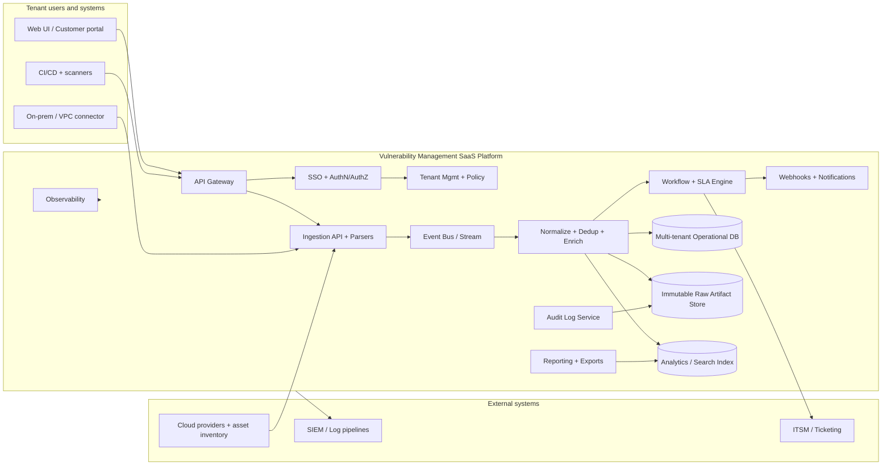
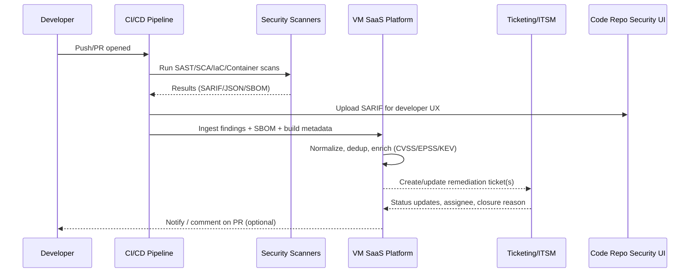
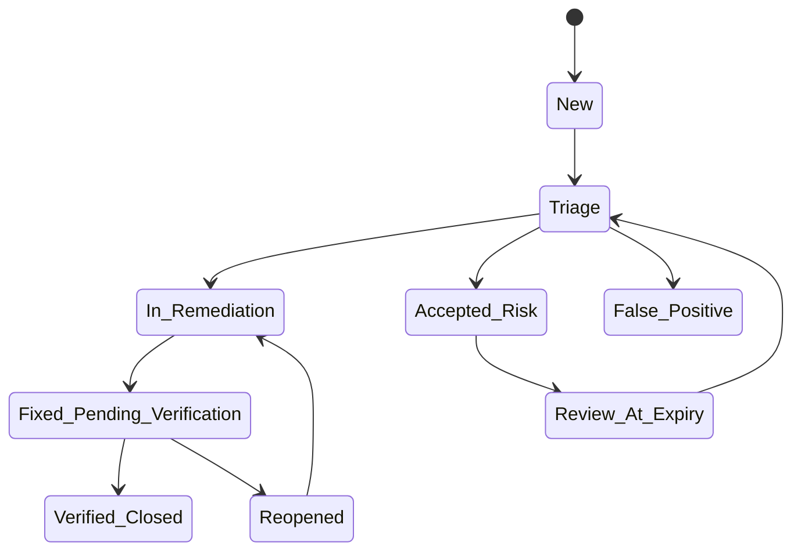
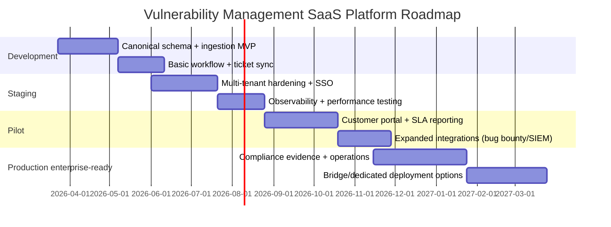

# Enterprise VM Reference Report

Status: Active enterprise planning and roadmap source of truth

## Execution Guardrail

Use this document as the sole planning and roadmap authority for the current
enterprise production-readiness lane.

- If any derived enterprise doc, task, brief, or tracker conflicts with this
  report, this report wins.
- Other repo files may still be read for code context, testing, and updating
  derived implementation artifacts, but not as competing roadmap sources.
- Keep derived enterprise docs aligned to this report instead of treating them
  as parallel authorities.

This document preserves the broader external research synthesis that now serves
as the approved enterprise direction guardrail for CVERiskPilot. It is the
single source of truth for enterprise roadmap intent, while code and
implementation files remain the place where the repo records what has actually
landed.

Note: the original `turnXsearchY` export citations have been removed from this
copy. If this document is reused in customer, audit, or executive-facing
material, replace any remaining research claims with clean source references.

## Original Research Title

Building an Enterprise-Ready Vulnerability Management SaaS Platform Integrated
with an Existing SaaS SDLC

## Executive summary

An enterprise-ready Vulnerability Management (VM) SaaS platform is best treated as a **workflow and data-normalization layer** that unifies vulnerability signals (SAST/SCA/DAST/IAST, IaC misconfiguration, container/image, cloud posture, external VM scanners, and bug bounty) into a **single, auditable remediation system** aligned to engineering delivery practices and enterprise governance. This approach reduces duplicated tooling, improves time-to-remediate, and makes SLAs measurable end-to-end across teams and tenants. Core design goals should be: (a) normalized ingestion using industry formats (e.g., SARIF for static analysis results, OSV for open-source vulnerability records, CycloneDX/SPDX for SBOM), (b) defensible prioritization (CVSS + exploit likelihood + “known exploited” signals), (c) tight SDLC and ITSM integration, and (d) strong tenant isolation with verifiable logging, retention controls, and compliance readiness.

A pragmatic “enterprise-ready” baseline usually includes: **multi-tenant architecture with explicit tenant isolation**, customer SSO (OIDC/SAML), SCIM provisioning, encryption in transit and at rest with disciplined key management, comprehensive audit logging, configurable retention and data residency options, and mature operational processes (incident response, vuln triage playbooks, communications). These are consistent with modern security control catalogs and identity guidance used as baselines in many enterprise programs.

Recommended architecture direction: a **multi-tenant SaaS “pool/bridge” model** (shared control plane + shared or selectively siloed data plane) with **customer-deployed connectors** for private network scanning and sensitive data sources. This matches well-established SaaS tenancy patterns (pool/silo/bridge) and avoids forcing on-prem customers to open inbound access.

Prioritization should combine:
- **Severity characteristics** (CVSS v4 or v3.x)  
- **Exploit likelihood** (EPSS probability of exploitation in the next 30 days)  
- **Active exploitation / directives** (CISA KEV catalog and, where relevant, required remediation due dates under BOD 22-01)  

Delivering enterprise readiness typically takes **phased rollout**: internal dev → staging hardening → limited pilot tenants → production with compliance evidence. The phased plan in this report includes concrete acceptance criteria for each phase.

## Assumptions and design principles

Assumptions (explicit because you requested “no specific constraint”):
- Target cloud provider, region strategy, and customer scale are unspecified. This report therefore proposes **cloud-neutral patterns** and highlights where cloud-specific features (e.g., tenancy isolation models, private connectivity, managed key services) may vary.  
- The platform integrates into an existing SaaS SDLC. Therefore, **APIs, webhooks, and event streams** are treated as first-class, and “workflow ownership” remains with engineering rather than a separate VM operations silo.  
- Vulnerability data may include sensitive customer context (hostnames, internal URLs, code locations, user identifiers). Privacy controls and retention must therefore be designed into the ingestion and storage model, consistent with privacy-risk management frameworks.  

Design principles:
- **Normalize, don’t replace**: ingest from best-of-breed scanners and systems of record; normalize to a consistent internal schema. (This aligns with common industry patterns: vulnerability tools produce heterogeneous outputs; unification requires a standard interchange format or an internal canonical model.)  
- **Evidence preservation**: store raw findings artifacts (immutable) and maintain transformation lineage for auditability. This is aligned with log management and audit expectations.  
- **Tenant isolation is a product feature**: enterprise customers will evaluate isolation posture (pool vs silo vs bridge) as strongly as feature depth.  
- **Risk prioritization must be explainable**: enable analysts and auditors to reproduce “why this was prioritized,” using CVSS, EPSS, KEV, and asset criticality inputs.  

## Product scope and enterprise feature set

A VM SaaS platform that integrates into an SDLC should model two primary objects:

- **Finding**: a detection event from a tool/source (scanner output, bug bounty report, pen test issue, etc.), including evidence and context.
- **Vulnerability case**: a deduplicated, workflow-managed unit representing “the thing that must be triaged/remediated,” potentially aggregating many findings across repositories, deployments, images, hosts, or tenants.

This separation is essential because scanner outputs are tool-shaped, while remediation is organization-shaped. Standard result formats (SARIF, OSV, CSAF/VEX) already encode the idea that findings and vulnerability metadata are related but distinct.  

### Functional capabilities mapped to your requested scope

**Vulnerability discovery and ingestion**
- Support pull-based ingestion (scheduled exports) and push-based ingestion (webhooks/upload APIs), because both are common across code scanners and infrastructure scanners.  
- Normalize identifiers wherever possible:
  - CVE identifiers and enrichment from the U.S. NVD repository.  
  - CWE weakness identifiers for AppSec-class findings.  
  - CPE naming where product matching is required (noting the operational complexity and false-positive risk of CPE mapping).  

**Triage**
- Workflow states (minimum useful set): New → Triaged → In Remediation → Fixed/Verified; plus exception states (False Positive, Accepted Risk, Mitigated, Duplicate, Not Applicable).  
- Policy-driven triage guidance aligned to secure development frameworks (e.g., incorporate secure development practices and vulnerability mitigation expectations into standard work).  

**Prioritization**
- Use a scoring stack that combines:
  - CVSS severity characteristics (v4 where available; maintain v3.x compatibility).  
  - EPSS exploit likelihood.  
  - Known exploited signals (KEV) and “due date” fields where present.  
  - Environmental/asset context (business criticality, exposure, data classification, internet-facing, privilege boundary). (This is an inference best practice: the CVSS standard explicitly includes environmental and threat metrics as modifiers to refine scoring in context.)  

**Remediation tracking**
- Bi-directional ticket synchronization with ITSM / engineering issue trackers (work item status, assignee, due date, closure codes).
- Support “remediation campaign” objects: one fix (e.g., image rebuild) closes multiple findings across services.
- Verification hooks: rerun scans, validate SBOM changes, or validate runtime posture.

**Reporting**
- Executive dashboards: risk backlog, KEV exposure, SLA status, MTTR, aging by severity and team.
- Audit-ready reports: “who decided accepted risk,” “what evidence supported false positive,” and “what changed in production.”

**SLAs**
- Policy engine to compute due dates based on severity + exploit signals + tenant contract terms.
- SLA views per tenant and per internal team.

**Customer portals**
- Enterprise customers typically want:
  - Tenant-scoped dashboard and exports
  - Evidence of handling process (triage, remediation ETA)
  - Communications history and advisories  
- When customers are both “tenant” and “asset owner” (hybrid/on-prem deployments), portals must also support local connector health and scan coverage metrics.

**RBAC**
- Minimum roles: Tenant Owner/Admin, Security Admin, Analyst, Engineer/Developer, Auditor/Read-only, and API-only service accounts.
- Fine-grained authorization: per-tenant, per-project/repo, per-environment, per-data-classification.

**Multi-tenancy**
- Tenant isolation at:
  - Identity layer (tenant-aware authz)
  - Data layer (partitioning/sharding strategy)
  - Compute layer (rate limits, resource quotas, noisy-neighbor controls)
- SaaS tenancy reference models (silo/pool/bridge) are widely used to choose trade-offs between isolation and efficiency.  

**Encryption**
- In transit: TLS with modern configuration guidance.  
- At rest: encryption with managed keys and key lifecycle controls (key management guidance is explicitly covered in NIST key management recommendations).  

**Data retention**
- Configurable retention by tenant and by data class (raw scanner artifacts often require different retention than aggregated metrics).  
- Secure deletion / sanitization approach on storage media is a known control area in data lifecycle guidance.  

**Audit logs**
- Centralized, tamper-resistant audit trails are a core expectation for enterprise security programs and are directly addressed in log management guidance.  

### Sample canonical vulnerability record schema and API contract

The platform should publish a **canonical JSON schema** for findings/cases to enable consistent ingestion, exports, and eventing. This aligns with the broader ecosystem trend toward standard interchange formats (e.g., SARIF, OSV, CSAF).  

Below is an example **VulnerabilityCase** (deduplicated remediation unit) and **Finding** (tool-originating observation). The schema is intentionally pragmatic: it captures what enterprise programs need for prioritization, workflow, evidence, and audit.

```json
{
  "vulnerability_case": {
    "id": "vc_01J6S4J9KJ9KQG6P3W2KZC8Q9T",
    "tenant_id": "tnt_4f2c1d",
    "title": "Outdated log4j version in payments-service container image",
    "vuln_ids": {
      "cve": ["CVE-2021-44228"],
      "osv": [],
      "cwe": ["CWE-502"],
      "vendor": []
    },
    "severity": {
      "cvss": {
        "version": "4.0",
        "base_score": 9.3,
        "vector": "CVSS:4.0/AV:N/AC:L/AT:N/PR:N/UI:N/VC:H/VI:H/VA:H/SC:N/SI:N/SA:N"
      },
      "epss": {
        "score": 0.71,
        "as_of": "2026-03-18"
      },
      "kev": {
        "listed": true,
        "due_date": "2026-03-30",
        "source": "CISA_KEV"
      }
    },
    "asset_context": {
      "environment": "production",
      "internet_exposed": true,
      "business_criticality": "high",
      "data_classification": "confidential",
      "service": "payments-service",
      "deployment_refs": [
        { "type": "kubernetes", "cluster": "prod-us-central-1", "namespace": "payments" }
      ]
    },
    "workflow": {
      "status": "in_remediation",
      "owner": { "type": "team", "id": "team_payments" },
      "sla_policy_id": "sla_default_enterprise",
      "due_at": "2026-03-25T23:59:59Z",
      "exceptions": []
    },
    "remediation": {
      "recommended_action": "Upgrade dependency and rebuild image",
      "tracking": {
        "tickets": [
          { "system": "Jira", "key": "SEC-1842", "url": "https://example.invalid/browse/SEC-1842" }
        ],
        "change_requests": []
      },
      "verification": {
        "required": true,
        "evidence": []
      }
    },
    "audit": {
      "created_at": "2026-03-18T12:10:00Z",
      "updated_at": "2026-03-18T15:02:11Z",
      "created_by": "svc_ingestion",
      "last_updated_by": "user_8321"
    }
  }
}
```

```json
{
  "finding": {
    "id": "fd_01J6S4M2Q2QJH9B3Q6K1Y5W1G7",
    "tenant_id": "tnt_4f2c1d",
    "source": {
      "type": "SCA",
      "name": "dependency-check",
      "run_id": "build_2026-03-18.1123",
      "ingested_at": "2026-03-18T12:09:41Z"
    },
    "artifact": {
      "type": "container_image",
      "uri": "registry.example.invalid/payments-service@sha256:abc123...",
      "sbom": { "format": "cyclonedx", "ref": "sbom_01J6S4..." }
    },
    "observations": {
      "package": { "name": "log4j-core", "version": "2.14.1", "ecosystem": "maven" },
      "vuln_ids": { "cve": ["CVE-2021-44228"], "cwe": ["CWE-502"] },
      "evidence": { "type": "sbom_match", "confidence": "high" }
    },
    "case_link": { "vulnerability_case_id": "vc_01J6S4J9KJ9KQG6P3W2KZC8Q9T" }
  }
}
```

For the public API, define contracts with OpenAPI (v3.1) so customers can generate SDKs and compliance teams can review the interface definition.  

Example endpoint set (high-level):
- `POST /v1/tenants/{tenantId}/findings:ingest` (idempotent ingestion; supports batch)
- `GET /v1/tenants/{tenantId}/vulnerability-cases` (filters: status, due_at, service, KEV, EPSS threshold)
- `PATCH /v1/tenants/{tenantId}/vulnerability-cases/{caseId}` (triage actions: assign, accept risk, mark false positive)
- `POST /v1/tenants/{tenantId}/webhooks` (subscribe to CloudEvents-shaped events)

CloudEvents is a practical interoperability layer for event streams and webhook payloads (standardizing metadata across services).  

## Architecture and deployment options

### Architecture option comparison

The table below compares deployment models that enterprises typically ask for. The “pool/silo/bridge” terminology is widely used in SaaS tenancy architecture discussions, and is explicitly documented in AWS SaaS guidance.  

| Option | Best fit | Tenant isolation | Data gravity / residency | Operational complexity | Pros | Cons |
|---|---|---|---|---|---|---|
| Multi-tenant SaaS (pooled) | High-scale SaaS, standard enterprise | Logical isolation (tenant ID + policy + crypto boundaries) | Usually provider-region based | Medium | Best cost efficiency; fastest feature velocity | Hardest to prove “strong isolation” to conservative buyers; noisy-neighbor risks |
| Multi-tenant SaaS (bridge) | Mixed enterprise segment portfolio | Mixed: pooled control plane + selective silo data plane | Better support for residency/dedicated storage | High | Enables dedicated DB/storage per tenant where required without duplicating everything | More complex provisioning and migrations |
| Dedicated single-tenant SaaS | Regulated / high-trust customers | Strong isolation (per-tenant infra) | Strong alignment to residency demands | High | Easiest enterprise security review; simpler “blast radius” arguments | Higher cost; slower scaling and patch rollout |
| Hybrid with on-prem connectors | Customers with private networks, restricted ingress | Data stays local except normalized metadata | Strong | High | Enables scanning/ingestion from private networks without inbound exposure | Connector lifecycle/security becomes critical; customer environment variance |
| Customer-hosted / on-prem platform | Air-gapped or extreme regulatory cases | Fully customer-controlled | Maximum | Very high | Customer owns infra and data fully | Hard to keep current; high support burden; slower innovation |

### Recommended reference architecture

A defensible “enterprise-ready” baseline is a multi-tenant SaaS platform, with:
- A **tenant-aware control plane** (identity, org config, policy, billing, audit configuration)
- A **data plane** built around ingestion → normalization/enrichment → workflow → reporting
- Optional **connectors/agents** deployed in customer environments for private network scanners and restricted systems

Mermaid architecture diagram:



This architecture is intentionally **API-first and event-driven**, using OpenAPI for interface contracts and CloudEvents-style metadata/eventing to reduce integration friction.  

### Multi-tenancy details that tend to matter in enterprise reviews

Enterprises will ask “how do you prevent cross-tenant data access?” and “how do you respond if a tenant is compromised?” Your design should be explicit about:

- **Data partitioning model** (row-level tenancy vs schema-per-tenant vs database-per-tenant). Cloud architecture guidance emphasizes trade-offs among cost, complexity, and isolation for multi-tenant data.  
- **Tenant-aware authz**: deny-by-default checks at every service boundary; avoid relying only on UI-layer filters. (This maps cleanly to common access control expectations in security control catalogs.)  
- **Rate limiting and quotas**: mitigate noisy neighbors (Kubernetes multi-tenancy guidance explicitly calls out fairness/noisy-neighbor risks).  
- **Per-tenant cryptographic boundaries**: at minimum, envelope encryption patterns with disciplined key management and rotation expectations.  

### Deployment options and connectivity patterns

**SaaS multi-tenant**
- Default for most customers; supports pooled or bridge isolation strategies.  

**Hybrid with connectors**
- Customer-deployed connectors should communicate outbound over TLS and be treated as production software (signed releases, auto-update channels, least privilege). Secure development and supply chain guidance provides the rationale for rigorous practices here.  

**On-prem connectors and APIs**
- Prefer “pull from SaaS” registration + outbound polling/websocket rather than inbound access, to reduce customer firewall changes.

**APIs, webhooks, event streams**
- REST APIs described using OpenAPI.  
- Webhooks and streams shaped as CloudEvents for consistent metadata across event types.  

## SDLC integration points and workflow automation

A VM platform integrated into an SDLC should “meet developers where they work” while preserving governance and auditability. Secure software development guidance explicitly encourages integrating security practices into existing SDLC implementations rather than treating them as separate add-ons.  

### Integration points across CI/CD and delivery

High-value control points:

- **Pre-commit / pre-push**: secrets scanning and fast linters.  
- **Pull request / merge request**: SAST, SCA, IaC scanning; enforce policy gates based on severity/KEV.  
- **Build**: container scanning, SBOM generation, provenance attestations.  
- **Deploy**: admission policies, config drift checks, runtime posture signals. (Container security risks and mitigations are a known topic in container security guidance.)  
- **Post-deploy**: DAST, continuous VM and cloud posture signals, plus bug bounty intake.

### Standard formats to operationalize integration

- SARIF is an OASIS standard for static analysis results interchange; it is also directly supported for displaying code scanning alerts in GitHub repositories, making it a practical interchange format for SDLC security results.  
- OSV schema is a standardized interchange format for vulnerabilities in open source packages (precise version mapping).  
- CycloneDX and SPDX are SBOM standards used to express component inventories; CycloneDX is also published as ECMA-424 with official schemas available.  
- CSAF is a structured format for exchanging security advisories; CSAF also includes a VEX profile and is referenced by CISA guidance on issuing VEX information.  

### SDLC-to-remediation integration flow



This flow leverages (a) SARIF interoperability for static results, (b) the platform’s role as system-of-record for triage and remediation state, and (c) ITSM ownership for change tracking and approvals where needed.  

### Ticketing workflow model and synchronization

A practical state model that aligns engineers + security:



Ticketing integration notes (high-value details):
- Use idempotent “upsert” semantics: findings can be re-ingested frequently.  
- Store a stable linkage key: `{tenant_id, case_id, ticket_system, ticket_key}`.  
- Sync only what should be authoritative from ITSM (assignee, status, due date); keep security rationale + evidence in VM system-of-record.

For ServiceNow integrations, the Table API supports CRUD operations on tables with role-based access control enforced by the platform.  
For Jira Cloud, REST APIs support issue operations and can be used to create/update work items.  

## Data ingestion and third-party integrations

This section provides: (a) ingestion patterns, (b) recommended tools (open-source and commercial), and (c) an integration matrix.

### Ingestion patterns

A mature ingestion layer generally needs all of the following:

- **Batch export ingestion** (pull): common for infrastructure VM tools (scheduled vulnerability exports).  
- **Push ingestion** (webhooks / upload): common for AppSec pipelines and bug bounty.  
- **Event enrichment feeds**: CVSS, EPSS, KEV, CPE/CWE mappings, and advisory/VEX feeds.  

Normalization should explicitly track provenance: store raw artifacts (immutable) and store normalized entities with a transformation lineage. Log management guidance supports the broader principle of retaining sufficient data detail for appropriate durations, and doing so in a controlled manner.  

### Integration matrix

The matrix below emphasizes: common integration targets, typical mechanism, and recommended data formats.

| Category | Example integrations | Primary mechanism | Recommended formats | Typical objects ingested |
|---|---|---|---|---|
| SAST | OASIS SARIF-producing tools; repo security UIs that accept SARIF | Push (CI upload) | SARIF 2.1.0 | Code locations, rule IDs, CWE tags |
| SCA / dependency | OWASP Dependency-Check; SBOM-based platforms | Push or pull | CycloneDX / SPDX + OSV mappings | Package versions, CVE/OSV IDs |
| DAST | OWASP ZAP automation | Push (pipeline) | JSON + evidence artifacts | URLs, parameters, request/response evidence |
| IaC configuration | Checkov; tfsec | Push (pipeline) | JSON + policy metadata | Misconfig findings, policy IDs |
| Secrets scanning | Gitleaks | Push (pre-commit/CI) | JSON | Secret type, file/line, fingerprint |
| Container/image scanning | Trivy; Grype | Push or pull | JSON + SBOM | OS & language packages, CVEs |
| Infrastructure VM scanners | Tenable / Qualys / Rapid7 exports | Pull (scheduled export) | Vendor JSON/XML + mapping | Assets, vuln instances, state |
| Cloud posture / findings | AWS Security Hub ASFF | Pull/push | ASFF JSON | Cloud resource findings |
| Bug bounty platforms | HackerOne API; Bugcrowd API | Pull + webhook | JSON API payloads | Reports, severity, communications |
| SIEM / log pipelines | Splunk HEC | Push (events) | CloudEvents-like + JSON | Audit logs, alerts, metrics |
| EDR / endpoint signals | CrowdStrike APIs (tenant-authenticated) | Pull | JSON | Endpoint posture, detections |
| ITSM / change mgmt | ServiceNow Table API; Jira REST | Bi-directional | JSON | Tickets, assignees, due dates |

### Recommended tools to integrate

Open-source (high adoption, automation-friendly):
- OWASP ZAP for DAST automation and API access.  
- OWASP Dependency-Check for SCA detection via CPE matching and CVE linkage; consider also Dependency-Track for SBOM-centric component analysis programs.  
- Trivy for scanning artifacts and misconfigurations across repos/images/clusters.  
- Grype for image/filesystem/SBOM vulnerability scanning.  
- Checkov and tfsec for IaC scanning.  
- Gitleaks for secret detection in repos and CI.  

Commercial (enterprise coverage, integrations, and support ecosystems):
- Tenable vulnerability export APIs (bulk and differential workflows are explicitly supported).  
- Qualys VMDR APIs (VM/PC API documentation provided by vendor).  
- Rapid7 InsightVM APIs (documented REST APIs for vulnerability management).  
- HackerOne and Bugcrowd APIs for bug bounty pipeline ingestion and automation.  
- Splunk HEC for pushing VM events into SIEM pipelines.  

## Security, compliance, privacy, and legal readiness

This section is organized around controls that enterprises commonly evaluate: identity, cryptography, auditability, secure SDLC/supply chain, and compliance/legal obligations.

### Security controls and hardening

**Authentication and authorization**
- Support OAuth 2.0 / OIDC for modern auth flows and API authorization patterns.  
- Support SAML 2.0 for enterprise SSO and federation.  
- Support SCIM for automated provisioning/deprovisioning (critical for enterprise offboarding controls).  
- Implement tenant-aware RBAC + optional ABAC (policy-based rules for environments/data classes).

**Secrets management**
- Centralize secrets, rotate regularly, avoid embedding in connector configs; treat connectors as high-risk “edge” software, so secrets and update mechanisms must be robust. (This is an inference grounded by secure development and supply chain frameworks emphasizing tamper resistance and integrity controls.)  

**Encryption in transit**
- Use TLS with configuration aligned to modern guidance for TLS selection and configuration.  

**Encryption at rest and key management**
- Use envelope encryption patterns with defined key lifecycle management policies (rotation, access controls, separation of duties). Key-management best practices are explicitly addressed in NIST key management recommendations.  
- For customers requiring it, support customer-managed keys (CMK/BYOK) and key separation per tenant.

**Audit logs**
- Record security-relevant events: auth events, privilege changes, triage decisions, SLA overrides, export actions, connector registrations, and data deletion requests.
- Ensure logs are tamper-resistant and retained per policy; log management guidance emphasizes the need for practical, enterprise-wide log management practices.  

**WAF and DDoS**
- Front-door protections (WAF, rate-limits, bot protection, DDoS mitigation) are table stakes for internet-facing SaaS. While implementation is provider-specific, these controls map to common availability and security expectations in enterprise control catalogs.  

**Supply chain security**
- Align development lifecycle to SSDF practices (secure development practices that integrate into SDLC).  
- Use SLSA concepts (provenance, tamper resistance) for build pipelines and connector release artifacts.  
- Generate and ingest SBOMs using SPDX/CycloneDX; use VEX/CSAF where appropriate to reduce “vulnerability noise” by declaring affected/not affected status in context.  

### Compliance requirements mapping

The table below maps common expectations across SOC2, ISO27001, PCI, HIPAA, and GDPR to platform capabilities. It is intentionally “control theme” level; auditors and counsel will require deeper mapping to your exact scope, data types, and customer contracts.

Primary/official anchors used:
- SOC 2 description and Trust Services Criteria references come from the AICPA.  
- ISO/IEC 27001 overview and purpose come from ISO.  
- PCI DSS purpose and baseline requirements are described by PCI SSC; PCI DSS v4.0 retirement timing is documented by PCI SSC.  
- HIPAA Security Rule and Breach Notification Rule summaries come from HHS.  
- GDPR breach notification interpretation is supported by EDPB guidelines (official EU board guidance).  

| Control theme | SOC2 | ISO27001 | PCI | HIPAA | GDPR |
|---|---|---|---|---|---|
| Governance & risk | Controls over security/availability/confidentiality/privacy in scope of report | ISMS requirements and continual improvement | Operational + technical baseline requirements for payment data protection | Administrative safeguards required | Accountability and risk-based measures (privacy by design expectations) |
| Identity & access | Logical access controls, least privilege, SSO alignment | Access control policies under ISMS | Strong access controls for cardholder data environments | Access controls as part of technical safeguards | Access controls contribute to “appropriate security” (risk-based) |
| Audit logging | Evidence of control operation and monitoring | Monitoring and logging controls under ISMS | Logging/monitoring expectations in payment security programs | Technical safeguards + audit controls | Documentation of incidents and breach response expected |
| Encryption & key mgmt | Confidentiality and security controls | Cryptography controls under ISMS | Protect account data; cryptographic controls | Encrypt/protect ePHI in transit/storage (risk-based) | Encryption cited as a security measure in breach guidance contexts |
| Vulnerability mgmt & patching | Demonstrable process and evidence | ISMS expects managed security processes | Requires ongoing vulnerability management in scope environments | Technical safeguards + risk management | Security of processing expectations; breach risk management |
| Incident response | Operational readiness is usually expected in audits; security and availability are core SOC2 concerns | Incident procedures and continual improvement | Incident response expectations for payment environments | Breach notification obligations after breach of unsecured PHI | Notify unless unlikely to risk rights/freedoms; 72-hour expectation described in guidance |
| Data retention & deletion | Confidentiality/privacy commitments must be demonstrable | Lifecycle controls under ISMS | Retain evidence as required by program | Record retention obligations vary | Storage limitation principle (implementation depends on lawful basis); operationalize via retention policies |
| Vendor/subprocessor mgmt | Common enterprise expectation | ISMS expects supplier controls | Third-party service provider management in payment ecosystems | Business associate obligations | Processor/subprocessor contracting is central to GDPR programs (implementation must be lawyer-reviewed) |

### Privacy, data retention, and anonymization

Treat privacy as an engineering constraint:
- Use privacy risk management frameworks to structure data minimization, purpose limitation, and de-identification decisions.  
- Separate data classes:
  - **Raw evidence** (scanner output, request/response, code excerpts) — highest sensitivity.
  - **Normalized case metadata** (IDs, titles, severity, timestamps) — often lower sensitivity.
  - **Aggregated metrics** (counts, MTTR, SLA attainment) — typically lowest sensitivity but still tenant-sensitive.

Anonymization/pseudonymization patterns (practical techniques):
- Tokenize user identifiers in raw findings where possible.
- Hash hostnames/URLs for aggregate reporting while preserving reversibility only for authorized tenant admins.
- Redact secrets and credentials using inbound inspection and secret scanners (e.g., integrate secret detection as part of ingestion hygiene).  

Retention:
- Provide tenant-configurable retention with default baselines (e.g., raw artifacts 90–180 days, normalized cases 1–3 years, audit logs 1–7 years), noting that actual periods depend on customer contracts and regulatory scope.
- Implement secure deletion practices aligned to recognized sanitization guidance where applicable.  

### High-level sample SLAs and legal clauses

Not legal advice; these examples illustrate typical structures and should be reviewed by qualified counsel for your jurisdiction, customer base, and data processing roles.

**Sample vulnerability remediation SLA policy (illustrative)**
- Critical (KEV-listed or EPSS ≥ 0.5 and CVSS ≥ 9.0): remediate or mitigate within **7 days**
- High (CVSS ≥ 7.0): **30 days**
- Medium (CVSS 4–6.9): **90 days**
- Low: **180 days**
- Exceptions: documented accepted risk with expiry date and re-review; false positives require evidence; “not applicable” requires VEX-style rationale where SBOM context applies.  
This structure is consistent with the idea that exploit likelihood and known-exploited status should influence prioritization (EPSS and KEV are specifically designed/provided for that purpose).  

**Sample availability SLA (illustrative)**
- Monthly uptime commitment: 99.9% for core APIs and UI
- Defined maintenance windows
- Service credits schedule
(If you formalize SLOs internally, define SLIs/SLOs explicitly; Google SRE guidance defines SLOs as targets measured by SLIs.)  

**Sample legal clause themes (high-level)**
- Security addendum: commit to encryption in transit (TLS), access controls (SSO/RBAC), vulnerability management process, and audited logging.  
- Incident notification: define timelines, content of notices, and cooperation obligations; align HIPAA breach notification obligations where applicable.  
- Subprocessors: disclose subprocessors, change notification periods, and objection mechanism (common in GDPR-oriented contracting; implementation varies).  
- Limitation of liability: standard SaaS limitations with carve-outs (gross negligence, willful misconduct), negotiated per enterprise deals.
- Vulnerability disclosure policy: publish a security.txt and VDP contact channel; security.txt is standardized as RFC 9116 and is encouraged by public guidance.  
- Coordinated vulnerability disclosure and handling: align internal PSIRT-style handling practices with ISO 29147 (disclosure) and ISO 30111 (handling).  

## Operations, QA, observability, and phased rollout plan

### Operational processes

A VM platform becomes enterprise-ready when the *people + process* layer is consistent and measurable.

**Incident response**
- Maintain an incident handling lifecycle (prepare, detect/analyze, contain/eradicate/recover, post-incident learning). Incident handling guidance is documented in NIST incident response publications.  

**Vulnerability triage**
- Establish triage playbooks per finding type: AppSec vs infra vs cloud posture vs bug bounty.
- Require explicit decision logging for false positives and risk acceptance (audit-friendly).

**Patch management**
- Patch management is a defined enterprise practice involving identification, prioritization, acquiring, installing, and verifying patches; this is directly described in enterprise patch management guidance.  
- Embed patch verification into workflow (re-scan, attestation, SBOM diff).

**Customer communications**
- Provide per-tenant communications timeline in customer portal (advisories, ETAs, mitigations).
- For product/vendor advisories, support publishing CSAF advisories and/or VEX statements when appropriate.  

**SLA metrics and escalation**
- Track MTTR by severity and by team, SLA breach counts, and KEV backlog aging.
- Escalation policy tied to SLA thresholds and exploitability signals.

### QA, testing, and validation

Enterprise customers expect ongoing assurance, not “one-time security testing.”

Recommended validation stack:
- Secure SDLC controls aligned to SSDF.  
- Continuous SCA/SAST in CI for the platform and connectors (including secrets scanning).  
- Regular penetration tests; periodic red-team-style exercises (scope depends on your threat model).
- Fuzzing on parsers and ingestion endpoints (parsers are a common attack surface because they handle untrusted input at scale).
- Container security controls and scanning aligned to container security guidance where containerization is used.  

### Observability and metrics

Define reliability as a product feature:
- SLO definitions should be explicit. Google SRE guidance defines an SLO as a target value/range measured by an SLI.  
- Use OpenTelemetry to standardize metrics/logs/traces collection and correlation across services.  

Minimum SLOs and KPIs (examples):
- API availability, P95 latency for core queries (cases list, case detail)
- Ingestion freshness (time from scanner completion to case creation)
- Dedup accuracy sampling rate
- SLA breach rate by tenant and severity
- Ticket sync lag and error rate
- Connector health (heartbeat uptime, queue backlog)

### Pricing, licensing, and enterprise sales considerations

Pricing in this category commonly mixes subscription and usage-based elements:
- Usage-based pricing is defined as charging based on actual usage rather than flat fees; both Stripe and OpenView describe usage-based pricing as a distinct SaaS model.  
- For VM platforms, “usage” is often measured as: number of assets/endpoints, number of repos, scan runs, ingested findings, or data retention volume.

Enterprise sales expectations often include:
- SSO (OIDC/SAML) and SCIM, audit logs, configurable retention, data residency options, security questionnaires, and contractual SLAs.  

### Phased rollout plan with acceptance criteria

The plan below is a reference roadmap. Timelines assume a capable team reusing existing components (auth provider, logging stack, CI tooling). Adjust based on your starting point.

| Phase | Target duration | Primary deliverables | Acceptance criteria |
|---|---:|---|---|
| Development | 8–12 weeks | Canonical schema + ingestion service; initial dedup; basic UI; baseline RBAC; initial integrations (1 CI scanner + 1 VM scanner); audit log MVP | End-to-end ingest → case creation → ticket creation works in a dev tenant; idempotent ingestion; basic tenant isolation tests pass; raw artifacts stored immutably |
| Staging | 6–10 weeks | Multi-tenant hardening; SSO integration; SCIM (optional early); retention policies; performance testing; parser fuzzing; security testing; observability instrumentation | SLOs defined and measured; load tests meet targets; audit logs cover critical actions; retention enforcement verified; penetration test findings triaged |
| Pilot | 8–12 weeks | Customer portal MVP; SLA policy/metrics; additional integrations (bug bounty + SIEM export); onboarding automation; support playbooks | Pilot tenants can self-serve onboarding; SLA dashboards correct; ticket sync reliability ≥ agreed threshold; customer security review issues addressed |
| Production enterprise-ready | 12–20 weeks | Compliance evidence pack; dedicated/bridge deployment option; data residency controls; incident response runbooks; financial ops (billing/usage metering) | “Enterprise checklist” satisfied: SSO/SCIM, audit logs, retention, encryption controls, IR playbooks executed in tabletop; operational on-call and escalation in place |

Resource estimate (typical for first enterprise-ready release; adjust for your org):
- 1 product manager, 1 architect/tech lead
- 4–6 backend engineers (ingestion, workflow, data)
- 2 frontend engineers (portal, dashboards)
- 1–2 platform/SRE engineers
- 2 QA/security engineers (automation + testing)
- 1 security/compliance lead (part-time early, full-time near production readiness)

Key risks and mitigations:
- **Normalization complexity and false positives** → start with a small set of high-value formats (SARIF + CycloneDX + 1–2 VM exports), preserve raw artifacts, and implement sampling-based QA on dedup logic.  
- **Tenant isolation failures** → adopt explicit tenancy models (pool vs bridge vs silo), implement automated isolation tests, and document the model for customer security reviews.  
- **Connector supply chain risk** → treat connectors as signed, provenance-attested deliverables; align with SSDF/SLSA practices.  
- **Breach/incident readiness gaps** → run tabletop exercises and align IR processes to published incident handling guidance.  

### Timeline chart



This timeline is a realistic starting point for an enterprise-grade VM platform because enterprise readiness is dominated by: multi-tenancy hardening, identity integration (OIDC/SAML/SCIM), audit logging and retention enforcement, and operational maturity (IR and SLAs).
